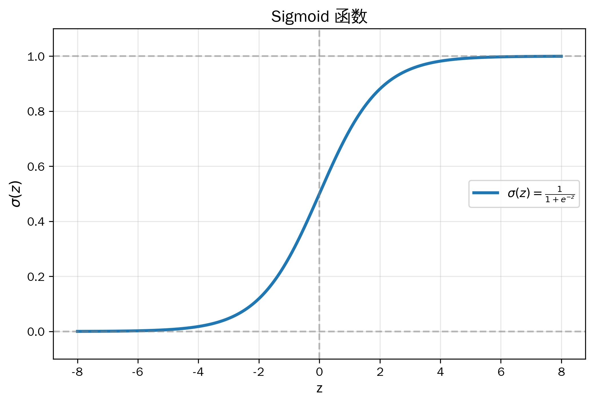

# 📖监督学习笔记

---

## 一、线性回归（Linear Regression）

### 1. 问题定义

**用途**：预测**连续值**输出（如房价、温度、销量）

**模型形式**：
$$
f_{\vec{w}, b}(\vec{x}) = \vec{w} \cdot \vec{x} + b = \sum_{j=1}^n w_j x_j + b
$$

- $\vec{x} = [x_1, x_2, ..., x_n]$：输入多个特征，每一个$x_n$对应一个特征，共有n个特征
- $\vec{w} = [w_1, w_2, ..., w_n]$：权重（特征系数），每个$w_n$对应一个特征
- $b$：偏置（截距）
- $f$：预测值

---

### 2. 代价函数（Cost Function）

#### 2.1 均方误差（MSE）

$$
J(\vec{w}, b) = \frac{1}{2m} \sum_{i=1}^m (f_{\vec{w}, b}(\vec{x}^{(i)}) - y^{(i)})^2
$$

- $m$：样本数量
- $\vec{x}^{(i)}$：第 $i$ 个样本
- $y^{(i)}$：第 $i$ 个样本的真实值
- 乘以 $\frac{1}{2} $ 是为了求导时消去平方导数中的系数 2
- 乘以 $\frac{1}{m} $ 是为了计算平均误差

#### 2.2 带正则化的代价函数（岭回归）

$$
J(\vec{w}, b) = \frac{1}{2m} \sum_{i=1}^m (f_{\vec{w}, b}(\vec{x}^{(i)}) - y^{(i)})^2 + \lambda \sum_{j=1}^n w_j^2
$$

- $\lambda$：正则化强度（超参数）
- 只惩罚权重 $w_j$，通常不惩罚偏置 $b$
- $\lambda$越大，惩罚越厉害，模型越容易欠拟合；$\lambda$越小，惩罚越小，模型越容易过拟合
- **作用**：防止过拟合与欠拟合，控制模型复杂度

---

### 3. 梯度下降（Gradient Descent）

**核心思想**：不断调整参数，使代价函数 $J$ 最小化

**更新公式**：
$$
w_j = w_j - \alpha \frac{\partial}{\partial w_j} J(\vec{w}, b)
$$
$$
b = b - \alpha \frac{\partial}{\partial b} J(\vec{w}, b)
$$
> 💡注意：$w_j$ 与 $b$ 同时更新！  

#### 3.1 无正则化的梯度

$$
\frac{\partial J}{\partial w_j} = \frac{1}{m} \sum_{i=1}^m (f_{\vec{w}, b}(\vec{x}^{(i)}) - y^{(i)}) \cdot x_j^{(i)}
$$
$$
\frac{\partial J}{\partial b} = \frac{1}{m} \sum_{i=1}^m (f_{\vec{w}, b}(\vec{x}^{(i)}) - y^{(i)})
$$

#### 3.2 带正则化的梯度

$$
\frac{\partial J}{\partial w_j} = \frac{1}{m} \sum_{i=1}^m (f_{\vec{w}, b}(\vec{x}^{(i)}) - y^{(i)}) \cdot x_j^{(i)} + \frac{2\lambda}{m} w_j
$$
$$
\frac{\partial J}{\partial b} = \frac{1}{m} \sum_{i=1}^m (f_{\vec{w}, b}(\vec{x}^{(i)}) - y^{(i)}) \quad \text{（b 通常不加正则化）}
$$

#### 3.3 参数更新

$$
w_j = w_j - \alpha \left[ \frac{1}{m} \sum_{i=1}^m (f_{\vec{w}, b}(\vec{x}^{(i)}) - y^{(i)}) \cdot x_j^{(i)} + \frac{2\lambda}{m} w_j \right]
$$
$$
b = b - \alpha \left[ \frac{1}{m} \sum_{i=1}^m (f_{\vec{w}, b}(\vec{x}^{(i)}) - y^{(i)}) \right]
$$

---

### 4. 超参数说明

| 超参数 | 含义 | 影响 |
|--------|------|------|
| $\alpha$（学习率） | 步长大小 | 太大：震荡/不收敛；太小：收敛慢 |
| $\lambda$（正则化强度） | 惩罚力度 | 太大：欠拟合；太小：过拟合 |
| 迭代次数 | 训练轮数 | 不足：未收敛；过多：浪费时间 |

---

### 5. 评估线性回归模型：决定系数（R²）笔记
#### 5.1.  决定系数是什么
**决定系数（Coefficient of Determination）**，记作 **$R^2$**，用来衡量**线性回归模型对数据的拟合程度**，取值范围：
$$0 \le R^2 \le 1$$

---

#### 5.2. 核心含义
$R^2$ 表示：
> **因变量 y 的总波动中，能被模型（自变量 x）解释的比例**
- $R^2=1$：完美拟合，所有点都在回归直线上
- $R^2=0$：模型完全没用，和直接用均值预测一样
- $R^2$ 越接近 1，拟合效果越好

---

#### 5.3. 数学定义（必记）
**三个关键平方和**
1.  **总平方和 SST（Total Sum of Squares）**
$$SST=\sum(y_i-\bar{y})^2$$
y 自身的总波动。
2.  **残差平方和 SSE（Sum of Squared Errors）**
$$SSE=\sum(y_i-\hat{y}_i)^2$$
模型没解释的波动。
3.  **回归平方和 SSR（Regression Sum of Squares）**
$$SSR=\sum(\hat{y}_i-\bar{y})^2$$
模型解释的波动。
关系：
$$SST = SSR + SSE$$  

**决定系数公式**
$$R^2 = \frac{SSR}{SST} = 1 - \frac{SSE}{SST}$$

---

#### 5.4. 直观理解
- 残差越小 → SSE 越小 → $R^2$ 越大
- $R^2$ 本质就是：**模型解释的波动 / 总波动**

---

#### 5.5. 一句话总结
$R^2$ 就是**回归模型对数据的解释力**，越接近1越好，但要结合修正$R^2$和残差分析一起判断模型好坏。

---

## 二、逻辑回归（Logistic Regression）

### 1. 问题定义

**用途**：**二分类**问题（如垃圾邮件判断、疾病检测）

**核心思想**：将线性回归的输出通过 Sigmoid 函数映射到 [0,1] 区间，表示概率

**Sigmoid 函数**：
$$
g(z) = \frac{1}{1 + e^{-z}}
$$  
   
**模型形式**：
$$
f_{\vec{w}, b}(\vec{x}) = \frac{1}{1 + e^{-(\vec{w} \cdot \vec{x} + b)}} = P(y=1 \mid \vec{x})
$$

- 输出值：$0 \le f \le 1$
- 预测类别：若 $f \ge 0.5$ 预测为 1，否则预测为 0

**理解**：
1. 逻辑回归 = 线性回归的输出 + Sigmoid 转换 + 用 0.5 做阈值分类  
2. Sigmoid 函数的作用就是：把任意实数变成 0 到 1 之间的数，这样我们就可以把这个数当作概率来理解。
3. 0.5 作为阈值是因为它对应着 z = 0，也就是线性回归结果的正负分界线。z 大于 0 就预测为正类，z 小于 0 就预测为负类。
4. 整个逻辑回归就是在做这样一件事：先算一个线性组合 z，然后用 Sigmoid 把它变成概率，最后用 0.5 来决定到底属于哪一类。

---

### 2. 代价函数（交叉熵损失）

#### 2.1 为什么不用均方误差？

- MSE 在逻辑回归中是非凸函数，有多个局部最小值
- 梯度下降可能无法找到全局最优

#### 2.2 单个样本的损失

$$
\text{Loss}(f, y) = 
\begin{cases}
-\log(f) & \text{if } y = 1 \\
-\log(1-f) & \text{if } y = 0
\end{cases}
$$

#### 2.3 合并形式

$$
\text{Loss}(f, y) = -y \log(f) - (1-y) \log(1-f)
$$

#### 2.4 代价函数（所有样本）

$$
J(\vec{w}, b) = -\frac{1}{m} \sum_{i=1}^m \left[ y^{(i)} \log(f_{\vec{w}, b}(\vec{x}^{(i)})) + (1-y^{(i)}) \log(1 - f_{\vec{w}, b}(\vec{x}^{(i)})) \right]
$$

#### 2.5 带正则化的代价函数

$$
J(\vec{w}, b) = -\frac{1}{m} \sum_{i=1}^m \left[ y^{(i)} \log(f) + (1-y^{(i)}) \log(1-f) \right] + \lambda \sum_{j=1}^n w_j^2
$$

---

### 3. 梯度下降

**更新公式**：
$$
w_j = w_j - \alpha \frac{\partial}{\partial w_j} J(\vec{w}, b)
$$
$$
b = b - \alpha \frac{\partial}{\partial b} J(\vec{w}, b)
$$

#### 3.1 预测值
$$
f_{\vec{w}, b}(\vec{x}) = \frac{1}{1 + e^{-(\vec{w} \cdot \vec{x} + b)}}
$$

#### 3.2 梯度公式（与线性回归形式完全相同！）

$$
\frac{\partial J}{\partial w_j} = \frac{1}{m} \sum_{i=1}^m (f_{\vec{w}, b}(\vec{x}^{(i)}) - y^{(i)}) \cdot x_j^{(i)} + \frac{2\lambda}{m} w_j
$$
$$
\frac{\partial J}{\partial b} = \frac{1}{m} \sum_{i=1}^m (f_{\vec{w}, b}(\vec{x}^{(i)}) - y^{(i)})
$$

> 💡 **关键洞察**：虽然代价函数不同，但梯度公式形式上与线性回归完全一致！

#### 3.3 参数更新
$$
w_j = w_j - \alpha \left[ \frac{1}{m} \sum_{i=1}^m (f_{\vec{w}, b}(\vec{x}^{(i)}) - y^{(i)}) \cdot x_j^{(i)} + \frac{2\lambda}{m} w_j \right]
$$
$$
b = b - \alpha \left[ \frac{1}{m} \sum_{i=1}^m (f_{\vec{w}, b}(\vec{x}^{(i)}) - y^{(i)}) \right]
$$

---

## 三、线性回归 vs 逻辑回归对比

### 1. 相同点

| 相同点 | 说明 |
|--------|------|
| **都是线性模型** | 都计算 $z = \vec{w} \cdot \vec{x} + b$ |
| **都用梯度下降优化** | 参数更新公式相同 |
| **梯度形式相同** | $\frac{\partial J}{\partial w_j} = \frac{1}{m} \sum (f - y) x_j$ |
| **都可以加正则化** | L1、L2 正则化对两者都适用 |
| **都假设特征线性组合** | 核心都是 $z = w_1x_1 + ... + w_nx_n + b$ |

---

### 2. 不同点

| 对比维度 | 线性回归 | 逻辑回归 |
|----------|----------|----------|
| **任务类型** | 回归（预测连续值） | 分类（预测概率/类别） |
| **输出范围** | $(-\infty, +\infty)$ | $[0, 1]$ |
| **激活函数** | 无（线性变换） | Sigmoid 函数 |
| **代价函数** | 均方误差（MSE） | 交叉熵损失（Cross-Entropy） |
| **决策边界** | 无（需要手动设阈值） | 有（$z = 0$） |
| **参数含义** | 直接影响输出 | 影响对数几率（log-odds） |
| **对异常值敏感度** | 非常敏感 | 相对不敏感 |
| **适用场景** | 房价预测、温度预测 | 垃圾邮件识别、疾病诊断 |

### 3. 核心区别一句话总结

| 模型 | 一句话总结 |
|------|-----------|
| **线性回归** | 直接预测数值，输出可以是任何实数 |
| **逻辑回归** | 先算线性组合，再用 Sigmoid 变成概率，最后用 0.5 分类 |

---

## 四、正则化深入理解

### 1. 正则化的作用

| 无正则化 | 有正则化 |
|----------|----------|
| 权重可能很大 | 权重被约束在较小范围 |
| 容易过拟合 | 防止过拟合 |
| 对噪声敏感 | 更鲁棒 |
| 训练误差小，测试误差大 | 训练误差略大，测试误差更小 |

### 2. L1 vs L2 正则化

| 类型 | 公式 | 特点 |
|------|------|------|
| **L2（岭回归）** | $\lambda \sum w_j^2$ | 权重趋近0但不等于0，平滑 |
| **L1（Lasso）** | $\lambda \sum \|w_j\|$ | 可使部分权重=0，特征选择 |

### 3. $\lambda$ 的选择

- $\lambda = 0$：无正则化，可能过拟合
- $\lambda$ 很大：模型过于简单，可能欠拟合
- 通常通过**验证集**或**交叉验证**选择最优 $\lambda$

---

## 五、决策边界（Decision Boundary）

### 1. 什么是决策边界？

决策边界是模型用来区分不同类别的**分界线**（或分界面）。

- 在二维空间中，决策边界是一条直线或曲线
- 在三维空间中，决策边界是一个平面
- 在高维空间中，决策边界是一个超平面

**通俗理解**：想象你在一张纸上画了一条线，线的左边是猫，线的右边是狗。这条线就是决策边界。

---

### 2. 逻辑回归的决策边界

逻辑回归的决策边界由 $z = \vec{w} \cdot \vec{x} + b = 0$ 决定。

**为什么是 $z = 0$？**

因为当 $z = 0$ 时，Sigmoid 输出 $f = 0.5$，正好是分类的阈值：
- $z > 0$ → $f > 0.5$ → 预测为 1
- $z < 0$ → $f < 0.5$ → 预测为 0
- $z = 0$ → $f = 0.5$ → 边界

**决策边界的形状取决于特征**：
- 如果只用原始特征（如 $x_1, x_2$），决策边界是一条直线
- 如果加入多项式特征（如 $x_1^2, x_2^2, x_1x_2$），决策边界可以是圆、椭圆或其他复杂形状

---

### 3. 决策边界的几何意义

假设有 2 个特征 $x_1$ 和 $x_2$：

**线性决策边界**：
$$
w_1 x_1 + w_2 x_2 + b = 0
$$
这是一条直线。

**例子**：$w_1 = 1, w_2 = 1, b = -3$，则 $x_1 + x_2 - 3 = 0$，即 $x_2 = -x_1 + 3$

- 线上方（$x_1 + x_2 > 3$）：预测为 1（●）
- 线下方（$x_1 + x_2 < 3$）：预测为 0（○）

---

### 4. 非线性决策边界（通过特征变换）

如果原始数据线性不可分（比如圆圈形状），可以通过加入多项式特征实现非线性决策边界。

**例子**：加入 $x_1^2$ 和 $x_2^2$ 后，决策边界可以是圆：
$$
x_1^2 + x_2^2 - r^2 = 0
$$
- 圆内：预测为 1（●）
- 圆外：预测为 0（○）

---

### 5. 决策边界总结

| 问题 | 答案 |
|------|------|
| 逻辑回归的决策边界是什么？ | $z = \vec{w} \cdot \vec{x} + b = 0$ |
| 决策边界是直线还是曲线？ | 取决于特征：线性特征 → 直线；多项式特征 → 曲线 |
| 为什么 $z=0$ 是边界？ | 因为此时 $f=0.5$，正好是分类阈值 |
| 决策边界的作用 | 把特征空间分成两个区域，每个区域对应一个类别 |

---
